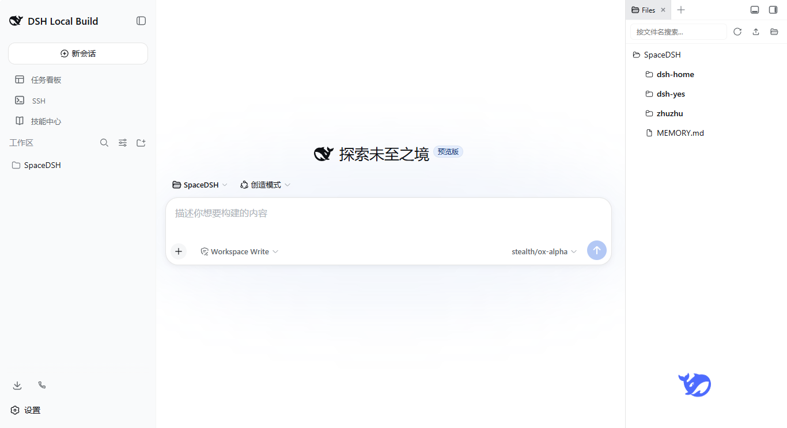
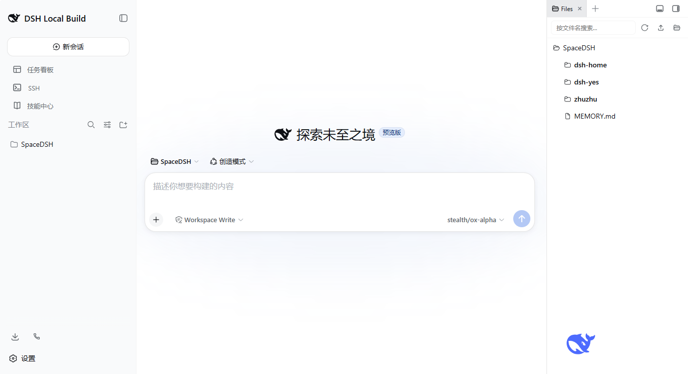

# dsh-whale-ui

为 [DeepSeek Harness](https://github.com/deepseek-ai/DeepSeek-Harness) 设计的一个极简小插件，在 Web 右下角添加一只游动的 DeepSeek 品牌鲸鱼。



## ✨ 功能

| 功能 | 说明 |
|------|------|
| 🐋 **品牌鲸鱼** | 使用 DeepSeek 官方 SVG Logo，品牌色 `#4d6bfe` |
| 🌊 **游动动画** | 鲸鱼在页面右下角左右游动（250px 幅度，24s 周期） |
| 💨 **浮动呼吸** | 同时上下浮动（15px 幅度，3s 周期） |
| 🔄 **掉头翻转** | 游到最左/最右时自动水平翻转，自然掉头 |
| ⏸️ **悬停暂停** | 鼠标悬停时所有动画暂停，显示提示词 |
| 👆 **点击关闭** | 点击鲸鱼后 2 秒渐隐消失 |

## 📦 安装

### 前置条件

- DeepSeek Harness 已部署并运行（`http://127.0.0.1:3080`）
- 拥有 DSH_HOME 目录访问权限

### 步骤 1：复制插件到 profile node_modules

```bash
# 将 host/ 目录复制到 DSH profile 的 node_modules
# Windows 示例：
xcopy /E /I "dsh-tool-whale\host" "%DSH_HOME%\profiles\web\node_modules\@deepseek-ai\dsh-tool-whale"

# macOS / Linux 示例：
mkdir -p "$DSH_HOME/profiles/web/node_modules/@deepseek-ai/dsh-tool-whale"
cp -r dsh-tool-whale/host/* "$DSH_HOME/profiles/web/node_modules/@deepseek-ai/dsh-tool-whale/"
```

等效手动路径（根据你的 DSH_HOME 调整）：
```
<DSH_HOME>/profiles/web/node_modules/@deepseek-ai/dsh-tool-whale/
├── index.js        # Cordis Host 插件入口
└── package.json    # 模块声明
```

### 步骤 2：注册到 cordis.patch.yml

编辑你的 DSH profile 配置文件：

```yaml
# 文件路径：<DSH_HOME>/profiles/web/cordis.patch.yml
- insert:
    # 其他已有条目...
    - id: tool-whale
      name: '@deepseek-ai/dsh-tool-whale'
```

如果 `cordis.patch.yml` 不存在，创建一个：
```yaml
- insert:
    - id: tool-whale
      name: '@deepseek-ai/dsh-tool-whale'
```

### 步骤 3：重启 DSH

```bash
dsh web --profile web
```

重启后打开 http://127.0.0.1:3080，右下角应该能看到小鲸鱼了！

## 🔧 自定义

如需修改鲸鱼行为（位置、颜色、速度等），直接编辑 `host/index.js` 中的注入代码：

| 可修改项 | 位置 | 默认值 |
|----------|------|--------|
| 游动范围 | `whale-swim` keyframes | `right: 50px ↔ 300px` |
| 浮动幅度 | `whale-float` keyframes | `translateY(-15px)` |
| 游动周期 | `.whale-container` animation | `24s` |
| 浮动周期 | `.whale-float` animation | `3s` |
| 渐隐时长 | `.whale-container` transition | `2s` |
| 初始位置 | `.whale-container` | `bottom: 35px; right: 50px` |
| 提示词文字 | JS 模板字符串 | `Click to close the whale !` |

修改后需**重启 DSH** 生效。

## 📁 项目结构

```
dsh-tool-whale/
├── host/
│   ├── index.js        # Cordis Host 插件（注入逻辑）
│   └── package.json    # npm 模块声明
├── README.md
├── LICENSE
└── .gitignore
```

## 🤝 贡献

欢迎提交 Issue 和 Pull Request！

## 📄 许可证

MIT License — 可以自由使用、修改和分发。


